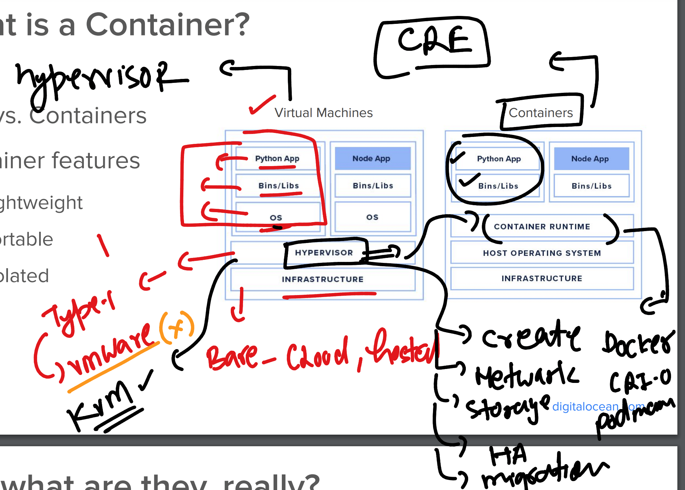
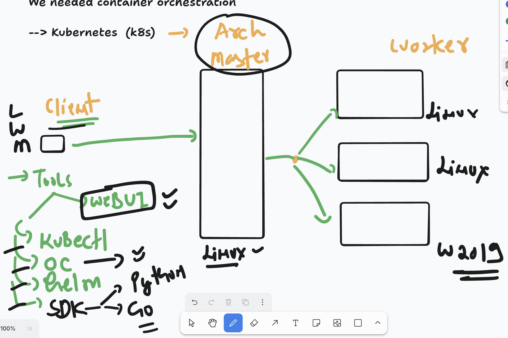
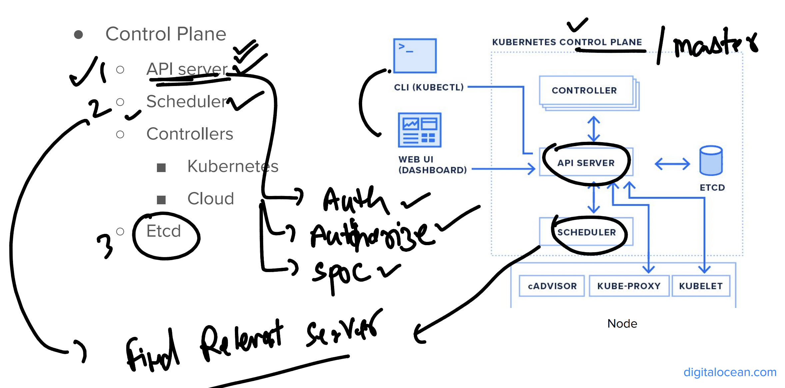
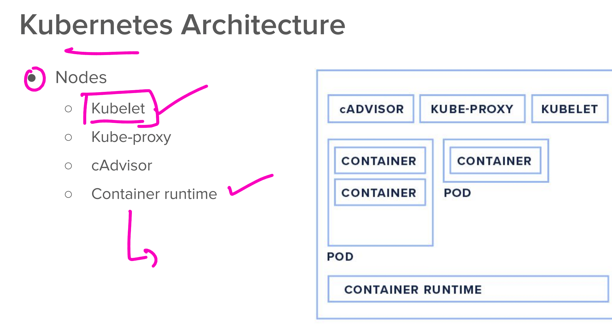
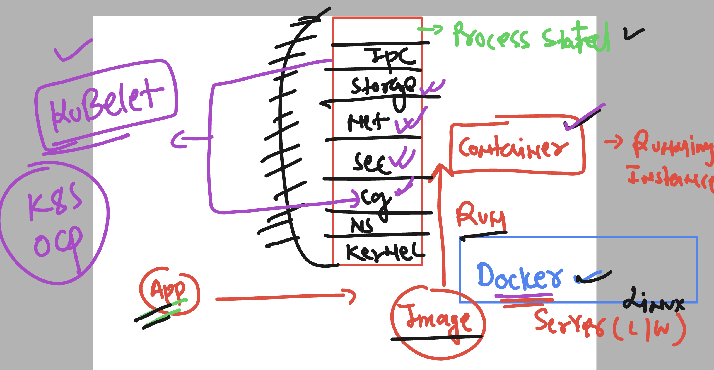
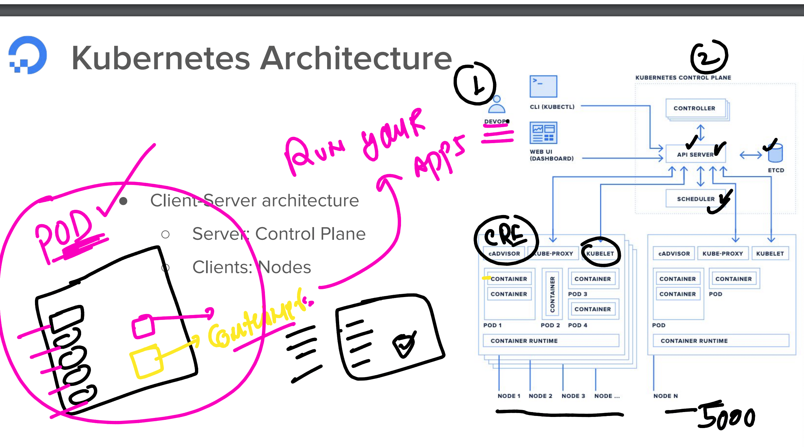

## VM and container things to Notice 



### OCP / k8s architecture basic points 



### IN ocp master / control plane Node -- Apiserver and scheduler 



### worker Node components in Openshift nodes 



### KUbelet component in ocp / k8s worker nodes 



### OCP architecture 


### info about POD in ocp 



## lets connect to student workstation machine and test client side tools 

### kubectl 

```
kubectl version 
```

### oc 

```
oc version 
```