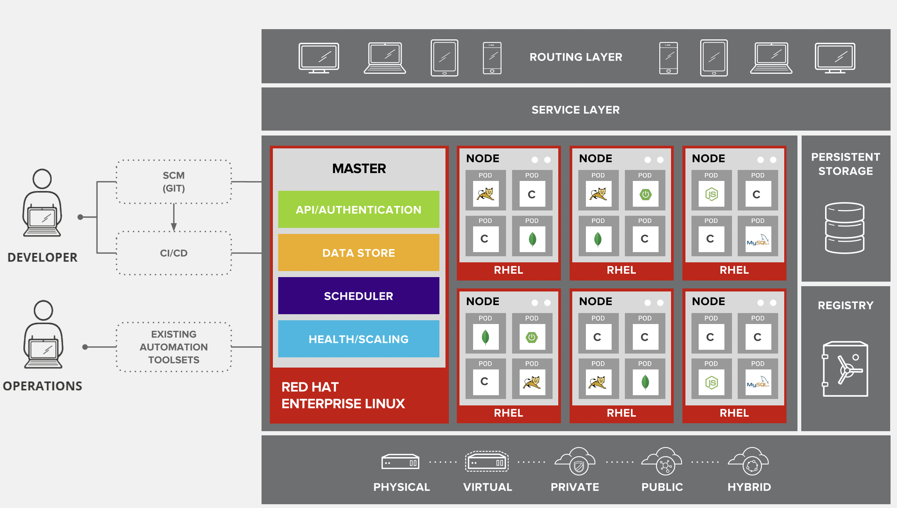

## VM and container things to Notice 


### OCP / k8s architecture basic points 


### IN ocp master / control plane Node -- Apiserver and scheduler 


### worker Node components in Openshift nodes 


### KUbelet component in ocp / k8s worker nodes 


### OCP architecture 



### info about POD in ocp 


## lets connect to student workstation machine and test client side tools 

### kubectl 

```
kubectl version 
```

### oc 

```
oc version 
```

## checking project details 


### creating pod using oc 

```
oc run ashupod1 --image quay.io/jay1123/nginx:codev1 

===> to check 
oc get pods
```

## Kubelet to connect any Hypervisor and create vm inside POd ENV 


### kubelet to KVM


### Info about Libvirtd 


### kubevirt visual look 


# kubevirt architecture 


## Components of kubevirt project 

### Virt-controller


### virt-handler -- managing vm on its own worker machine only


### virt-launcher --  A pod that wraps and runs actual VM using KVM /libvirtd

