## Revision & key points to remember 

### ocp in pod container context 


### To login into ocp cluster from a client machine one of the way is 

```
oc login -u admin -p redhatocp  https://api.ocp4.example.com:6443
```

### verify ocp virtualization operator status 


### checking ocp console url details 


### in OCP we can create VM using 2 resources in OCP  


### VMI vs VM 


## accessing vm in ocp env 


### using virtct to manage vm 

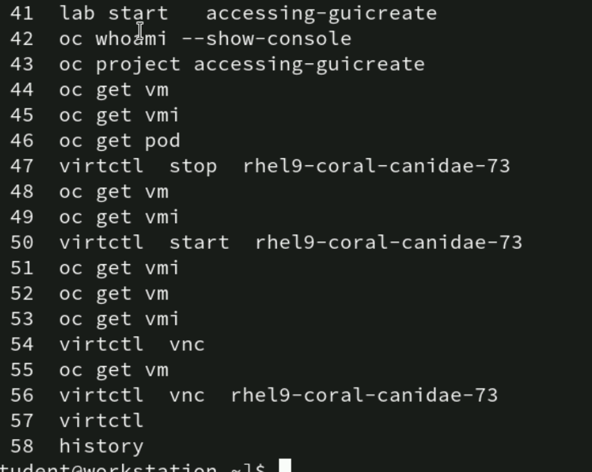

## virt-lancher pod can also handle vm using -- tool -- virsh

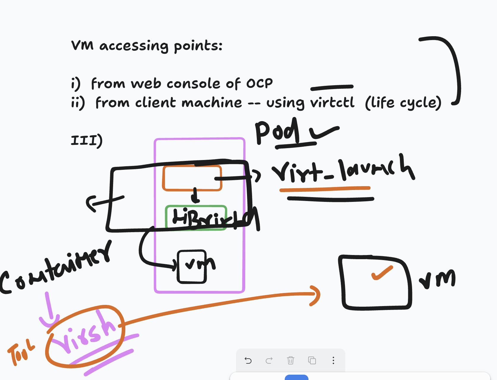

### accessing using virt-launcher pod 

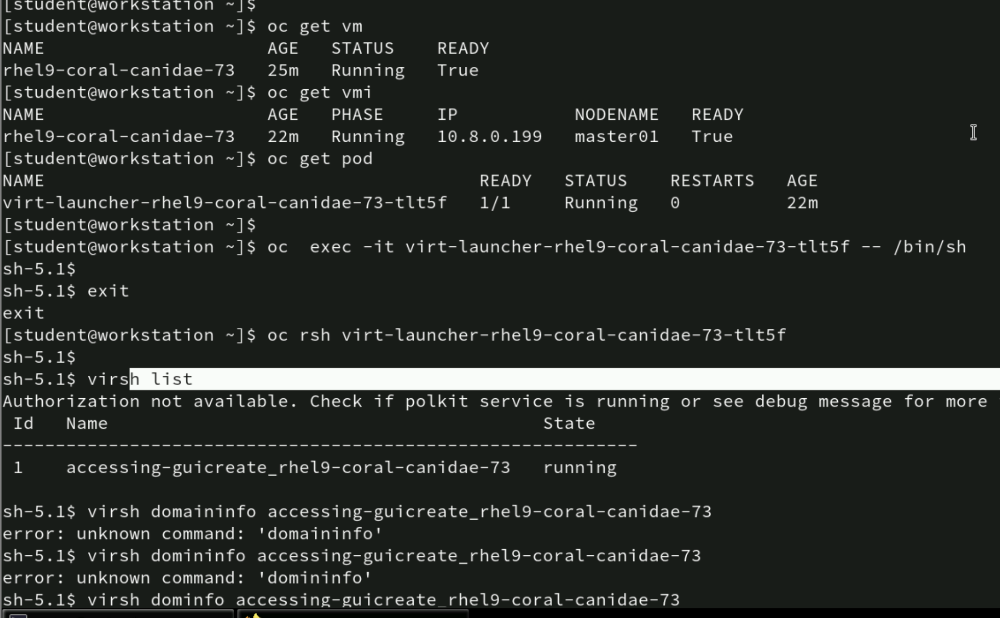

# Networking in OCP 

### POD networking using CNI 

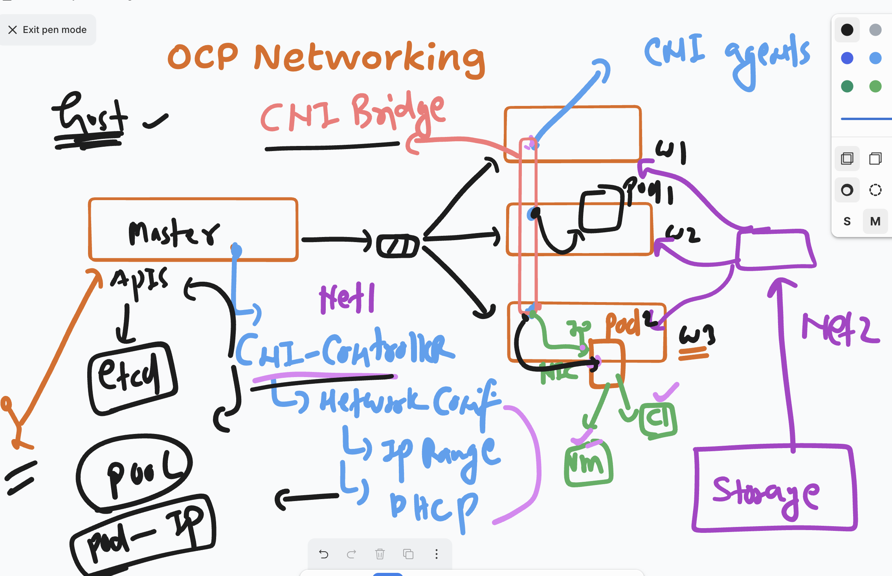

## by default pod can communicate but its not a good idea to do communication using pod IP

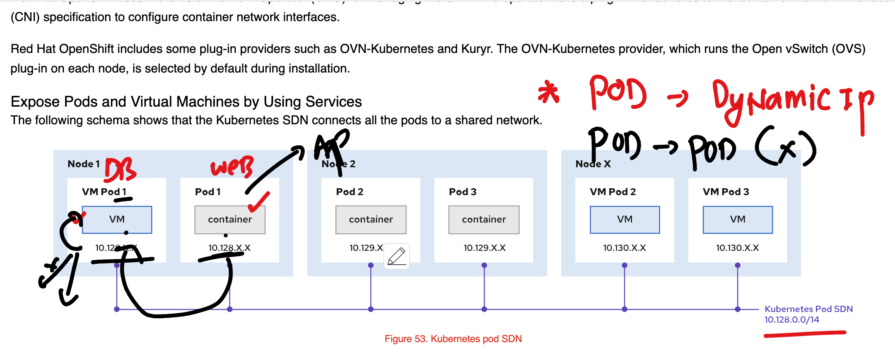

### service in openshift ENV 

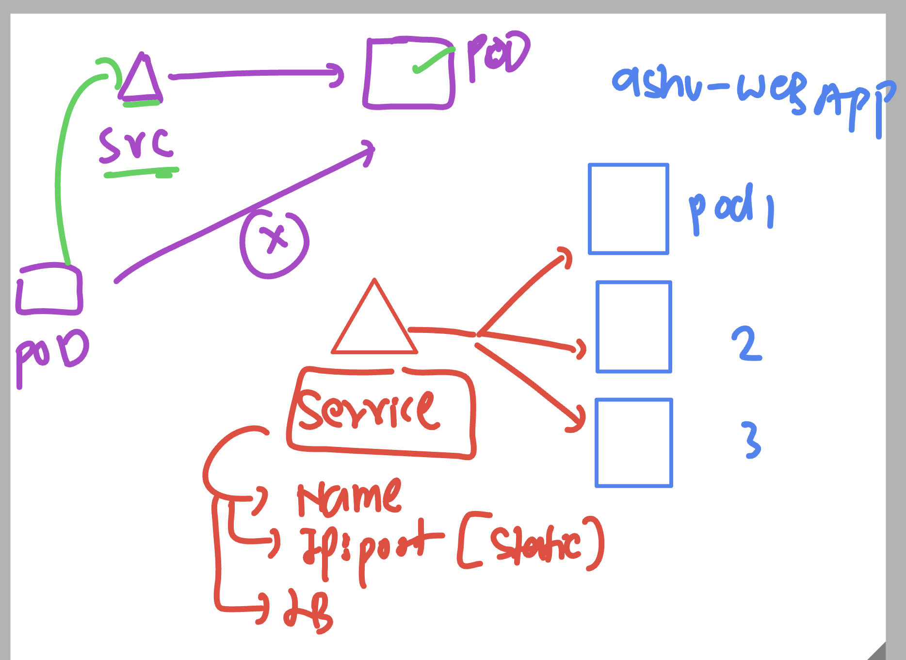

### creating clusterIP type service 

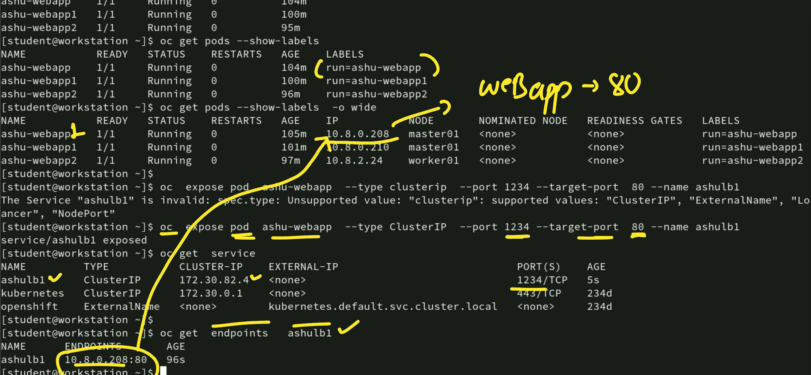

### clusterip vs Nodeport/Loadbalancer 

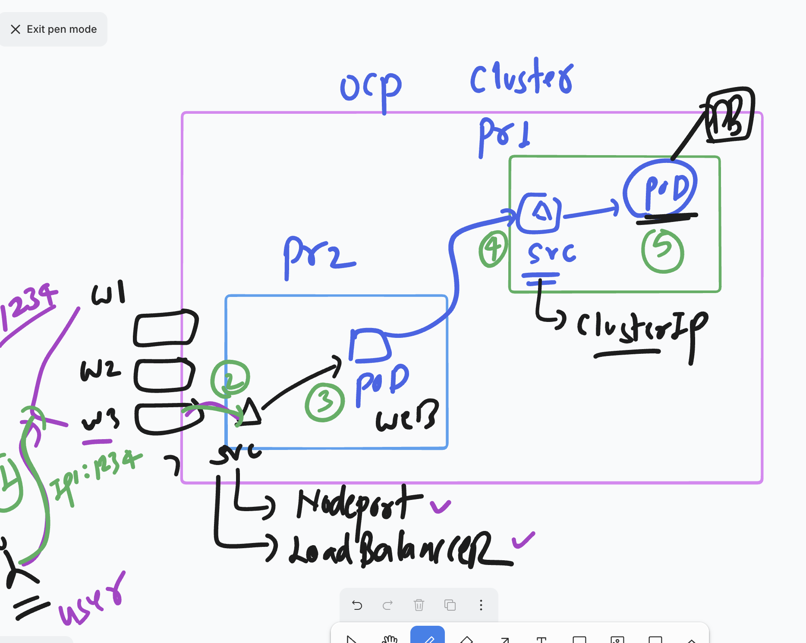

### checking default network of service and pod ranges in OCP cluster 


### service name with internal DNS in ocp 


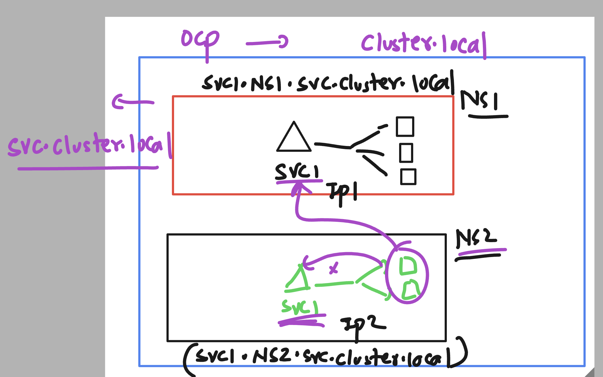

### to create service in OCP 

```
virtctl expose  / oc expose 

```
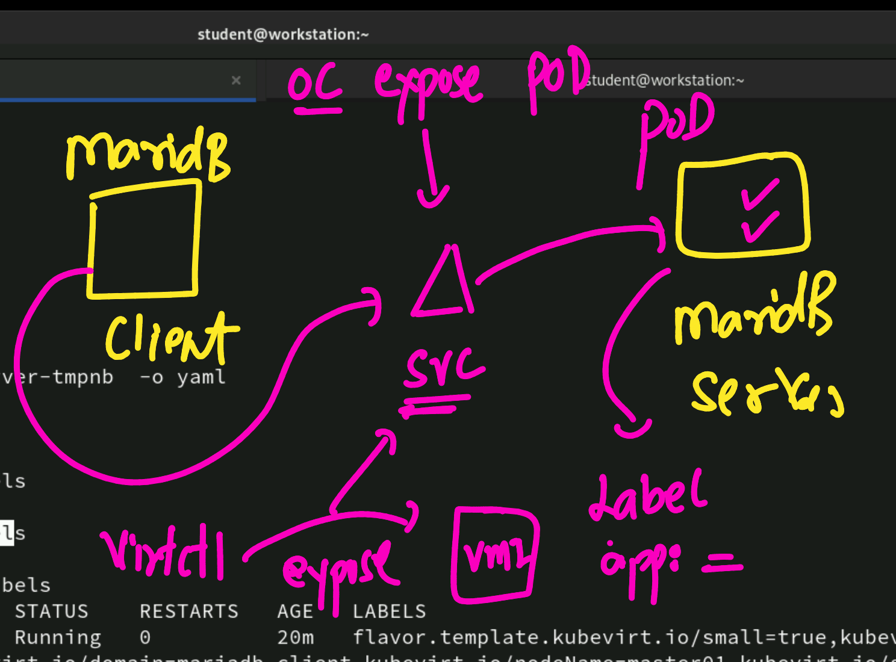

### creating and verify service 


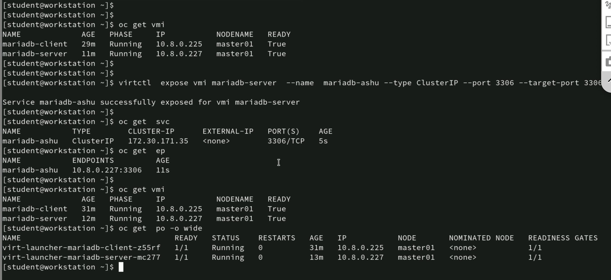