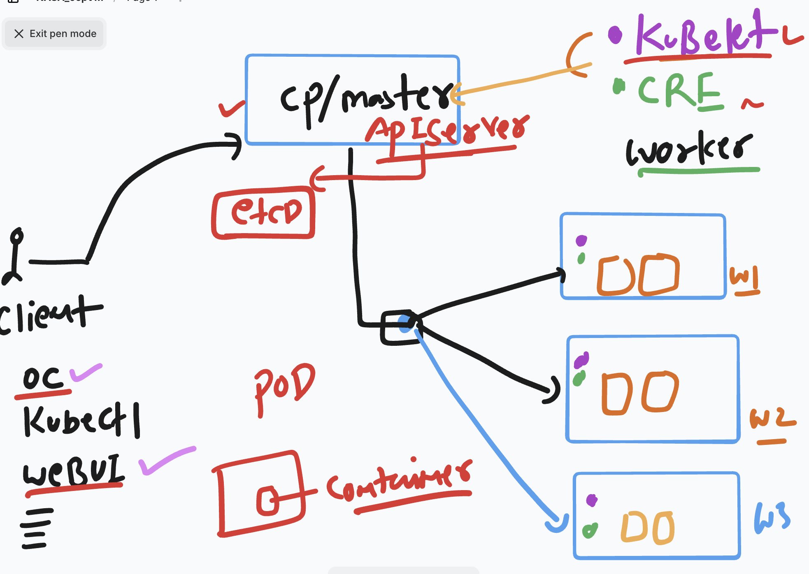
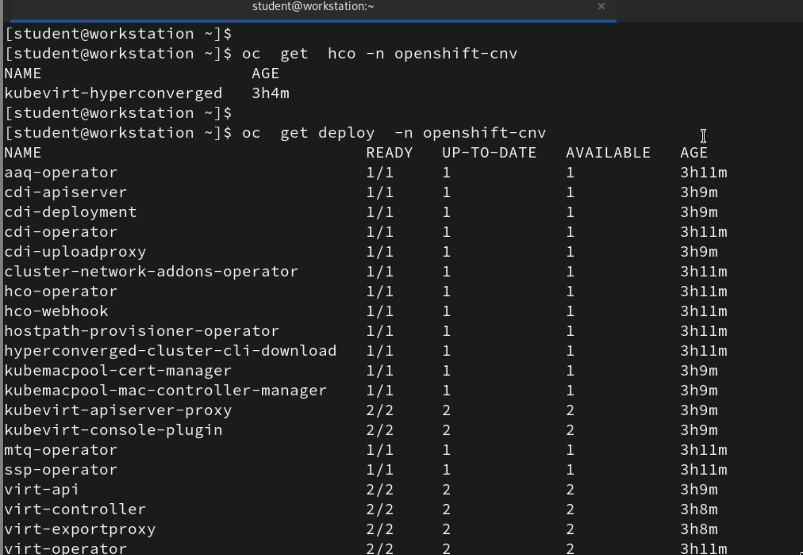
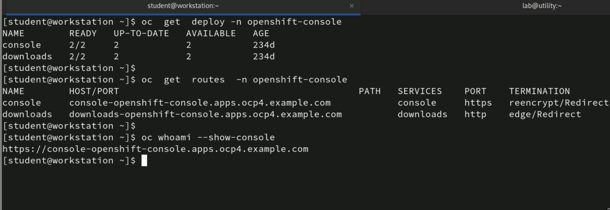
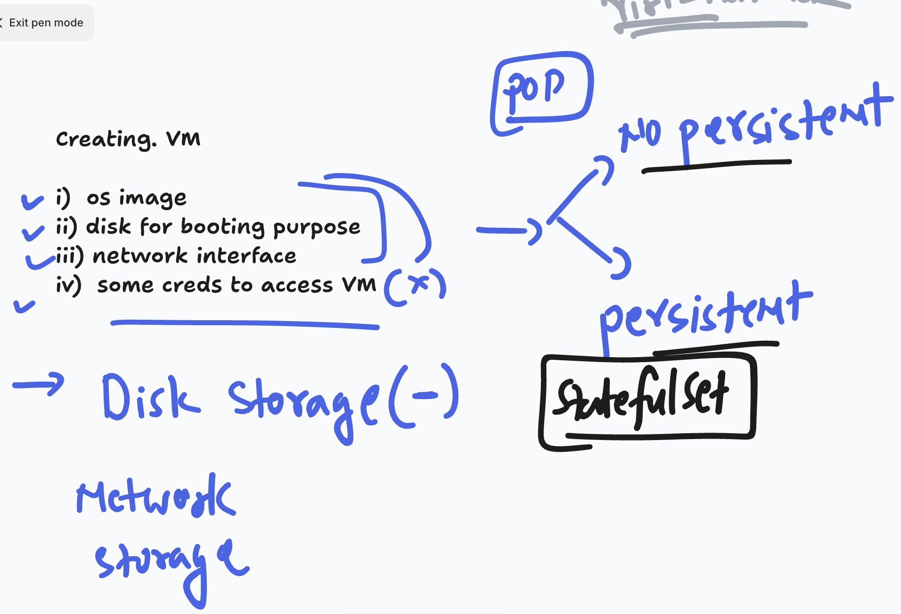
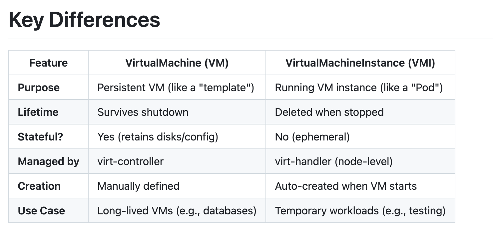
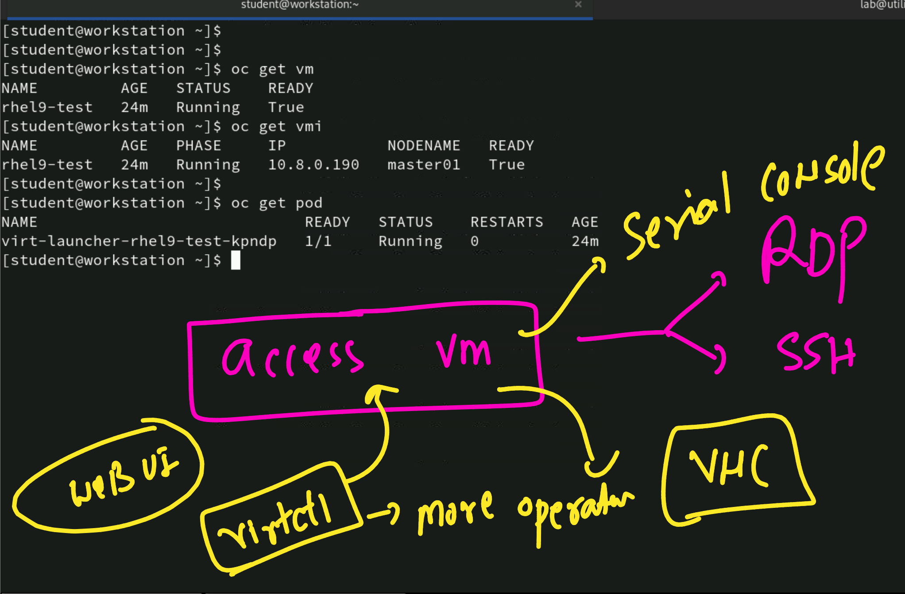

## Revision & key points to remember 

### ocp in pod container context 



### To login into ocp cluster from a client machine one of the way is 

```
oc login -u admin -p redhatocp  https://api.ocp4.example.com:6443
```

### verify ocp virtualization operator status 



### checking ocp console url details 



### in OCP we can create VM using 2 resources in OCP  



### VMI vs VM 



## accessing vm in ocp env 

