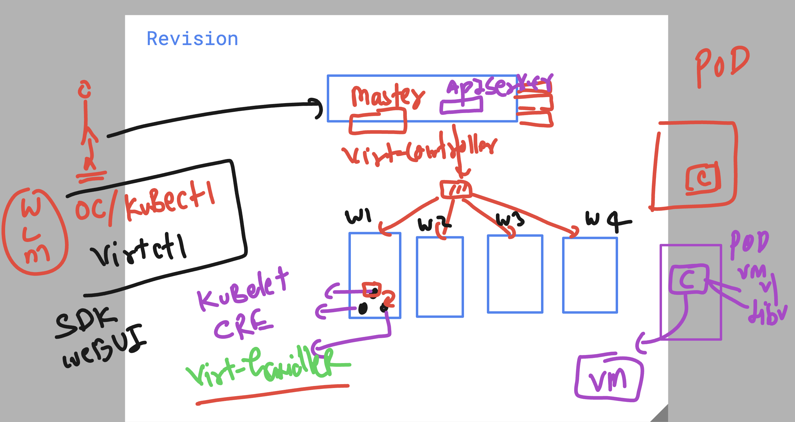
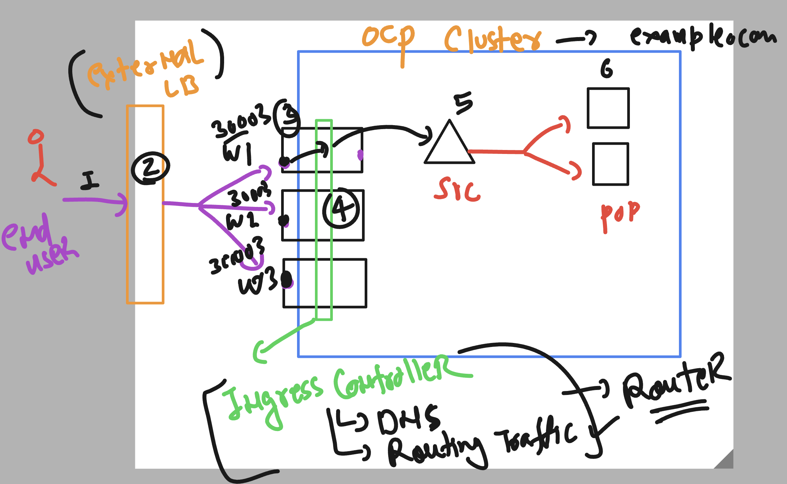
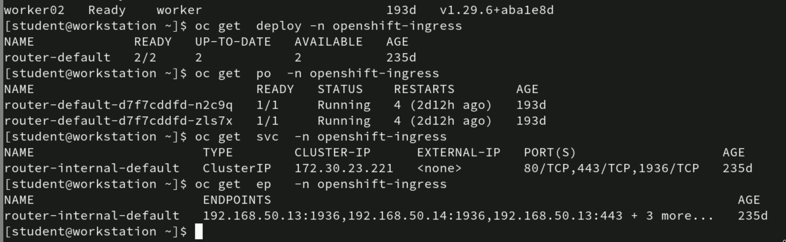
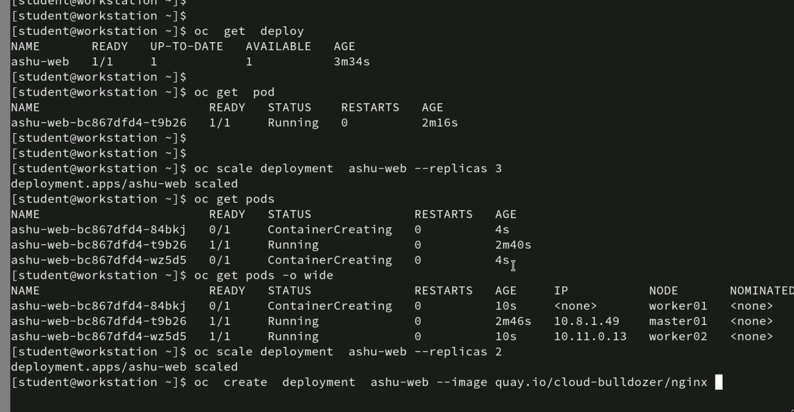
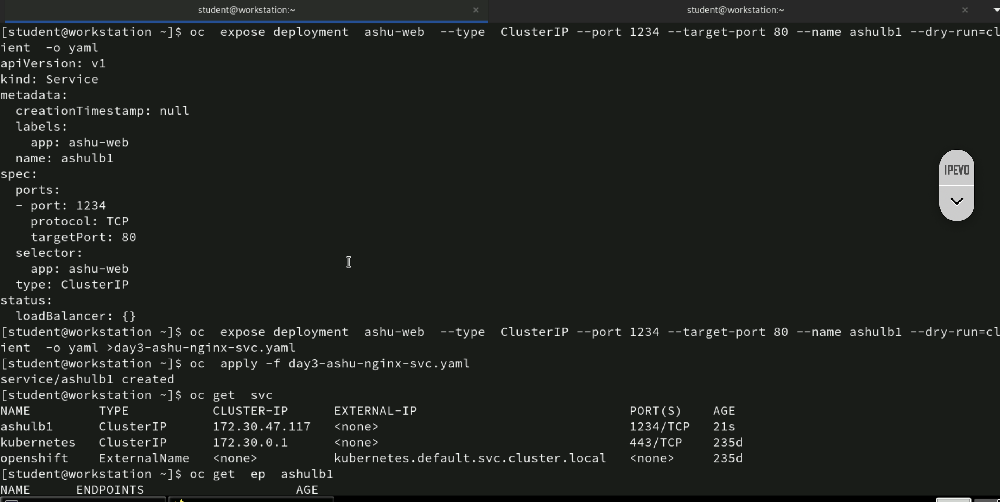

# NASA_OCP_virtualization_23rdJune2025

### OCP + kubevirt project 

### Exposing pod app (container / vm)  to outside OCP cluster -- using Router (Ingress+dns)

### verify openshift router status 

### Creating pod using deployment 

### exposing deployment to create service 

