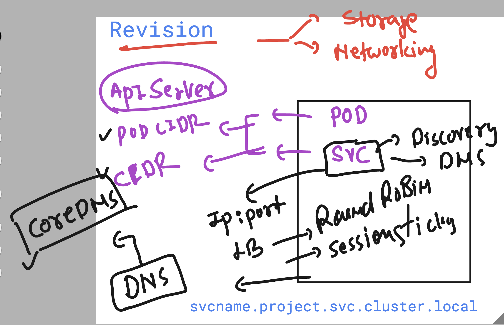
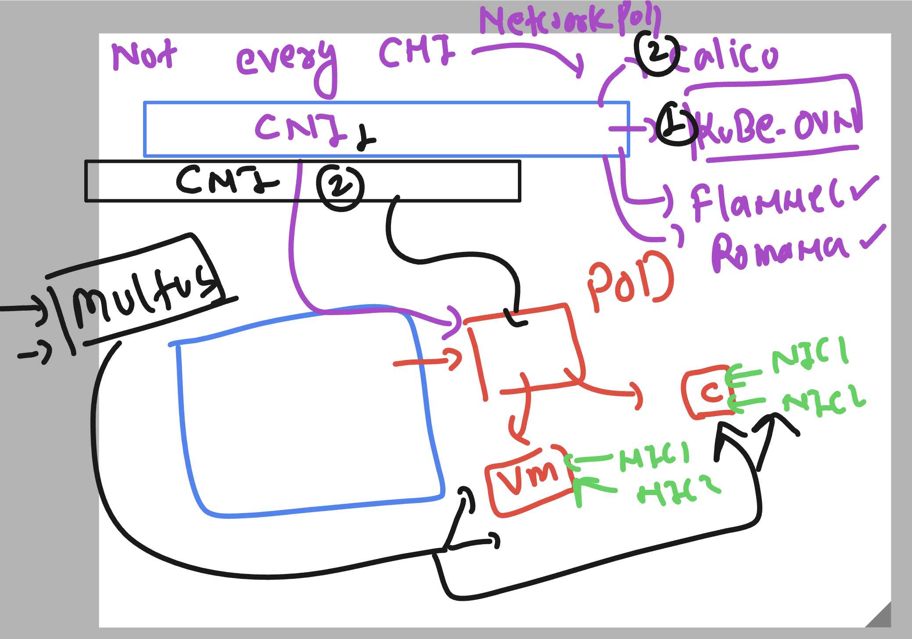
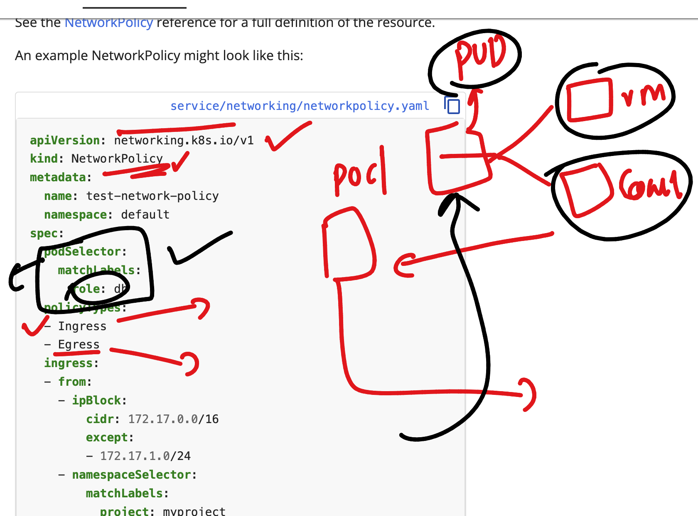
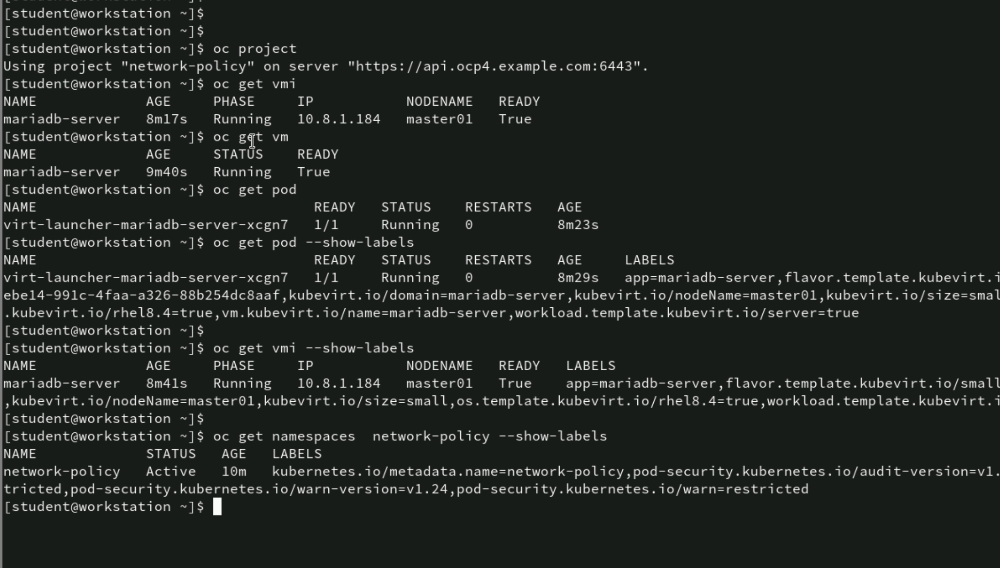
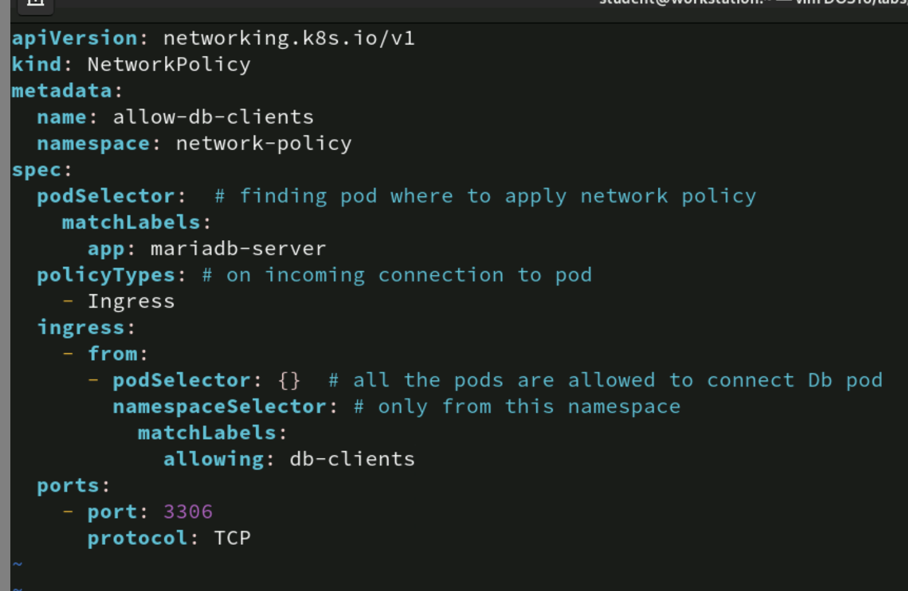
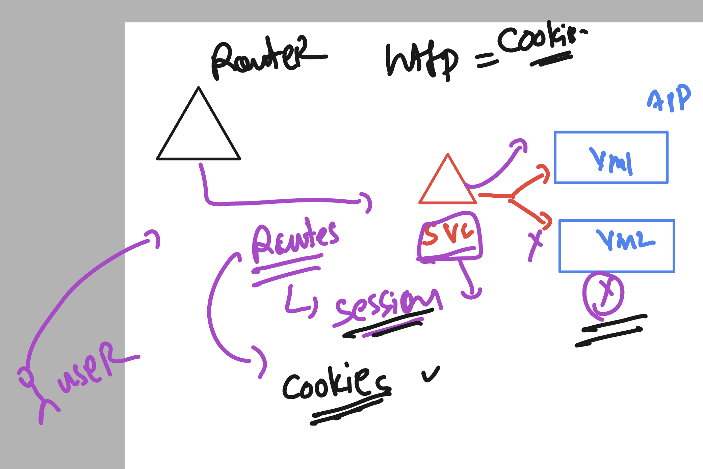
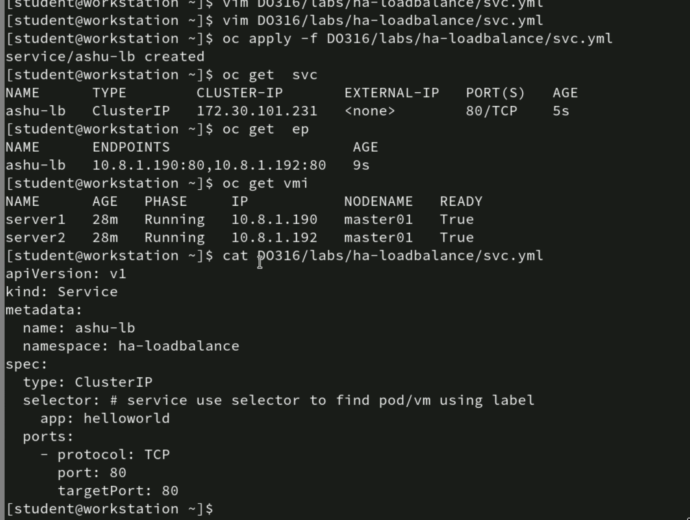
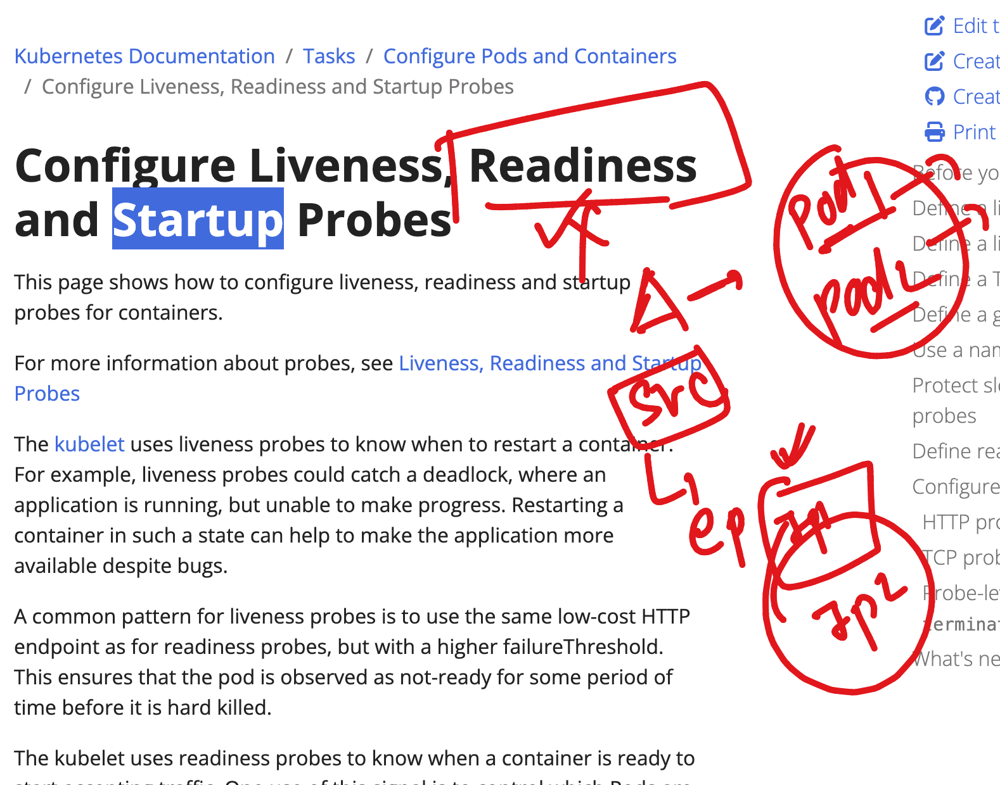
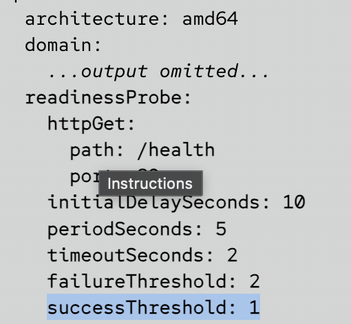

# NASA_OCP_virtualization_23rdJune2025

### ocp networking revision 

### Networkpolicy and CNI info 

### Storage in OCP ENV 

## Network policy 

### for network policy we need to have labels in target entity 

### checking network policy manifest file 

## HA in OCP for app running in POD -- container /vm 

### Creating service 

### ReadinessProbe in OCP 

### readyness in VM 

